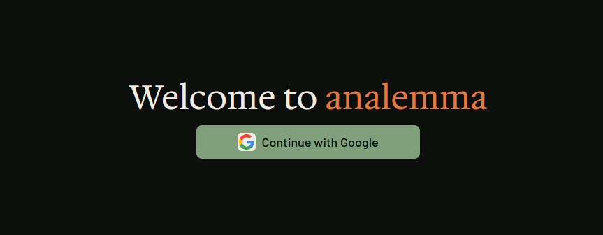

# analemma

Automated Ring camera timelapse generator. Runs daily via GitHub Actions to create timelapses from Ring doorbell footage and stores them in Cloudflare R2.

Web interface built with Next.js for viewing and managing generated videos.
